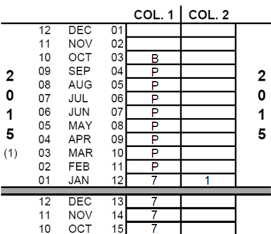

```{r setup, include=FALSE}
knitr::opts_chunk$set(echo = FALSE)

# Required dataset (see x0_masterfile)
all_sss <- read.csv("agregated_contraceptiveUse.csv")

# required packages
library(dplyr)
library(ggplot2)
library(ggfortify)
library(kableExtra)
library(DHScalendR)

# To get same font everywhere
windowsFonts(ArN = windowsFont("Arial Narrow"))

```

# Background

* Maternal and reproductive health globally lags behind.
* 200 million women still desire but don't have access to contraception.
* Better identify and evaluate interventions should help improving family planning use.
* The **Demographic Health Surveys (DHS)** are a crucial source of information:
  + Hundreds of surveys in over 90 countries since 1984
  + Typically every 5 years
  + Reference of health and population database for several low- and middle-income countries
  + Funded by the U.S. Agency for International Development (USAID)
* Many DHS include a section recording reproductive history of women, the **DHS calendar**.

```{r calendar, echo=FALSE, fig.cap="Example of a DHS calendar filled for one year from DHS website. Birth, pregnancy and contraceptive use are coded in column 1 and related events in column 2 for each months.", out.width = '50%', fig.align = "center"}

```


# Objectives

We suggest a time series approach using the DHS calendar to:

1. **Find** historical changes in contraceptive use
2. **Evaluate** a potential long-term changes by a known intervention

Examples of both are shown here studying contracetive use for:

* Women between 20 and 40 years old
* Senegal
* 2005 to 2015


# Acknowledgement

Dr. Britt McKinnon for her guidance and inspiration for this project.

Funding for this project comes mostly from a Doctoral scolarship awarded by the Fonds de recherche du Québec - Santé (FRQS).


# 1 - Finding changes

**Method:** change points are identified with the strucchange package in R using an algorithm by Bai and Perron 2003

```{r orWhereToFindThem, echo=FALSE, out.width='85%', fig.height = 12, fig.align='center', fig.cap='Historical trend of contraceptive use in Senegal (plain line) with individual months (orange dots) from the calendar section of six consecutive DHS; changepoints detected are shown (vertical dash lines) with uncertainty about when it happened (horizontal red lines, 95% confidence interval).'}

x <- length(unique(all_sss$surv))

# Plots layout
par(mfrow=c((x+1), 1))
par(mar=c(0.5, 5, 0.5, 2)) #Dwn-L-Top-R
par(family = "ArN")

for(survs in unique(all_sss$surv)){
    # Get data
    dfM <- all_sss %>% filter(surv == survs)
    
    # Prepare data
    dfM$calendarDate <- cmc_to_Year(dfM$calendarDate)
    dfM$meanModern_W <- dfM$meanModern_W * 100
    dfM <- dfM %>% filter(calendarDate != max(calendarDate))
    
    # Switch to ts format
    dts <- ts(data = dfM$meanModern_W,
              start = c(floor(min(dfM$calendarDate)),
                        round(min(dfM$calendarDate)%%1) + 1),
              frequency = 12
    )
    
    # Find breakpoints
    tt <- 1:length(dts)
    trend_change <- strucchange::breakpoints(dts ~ tt)
    
    # Plot breakpoints
    if(x == 1){ # Last plot (with xaxis numbers)
      plot(dts,
           ylab = NA,
           xlim = c(2005, 2017),
           ylim = c(1, 27),
           type = "p",
           pch = 19,
           cex = 1.2,
           col = rgb(0.86, 0.55, 0, 0.5),
           xaxt = "n",
           yaxs="i"
      )
      lines(fitted(trend_change), col = rgb(0.32, 0.06, 0.68) )
      lines(confint(trend_change))
      mtext(paste("DHS", unique(dfM$yearSurv)), 
            side = 4, 
            line = 1)
      axis(side = 1, cex.axis = 1.5)
      mtext("Years covered by DHS calendar",
            side = 1,
            line = 6,
            cex = 1.5)
    } else if(x == 4){ #Middle plot (with y label)
      plot(dts,
           ylab = NA,
           xlab = NA,
           xlim = c(2005, 2017),
           ylim = c(1, 27),
           type = "p",
           pch = 19,
           cex = 1.2,
           col = rgb(0.86, 0.55, 0, 0.5),
           xaxt = "n",
           yaxs="i"
      )
      axis(side=1,labels=F) 
      lines(fitted(trend_change), col = rgb(0.32, 0.06, 0.68) )
      lines(confint(trend_change))
      mtext(paste("DHS", unique(dfM$yearSurv)), 
            side = 4, 
            line = 1)
      mtext("Women recalling modern method use (%)", 
            side = 2,
            line = 3,
            cex = 1.5)
    } else{ # Others (no labels, no x-axis)
      plot(dts,
           ylab = NA,
           xlab = NA,
           xlim = c(2005, 2017),
           ylim = c(1, 27),
           type = "p",
           pch = 19,
           cex = 1.2,
           col = rgb(0.86, 0.55, 0, 0.5),
           xaxt = "n",
           yaxs="i"
      )
      axis(side=1,labels=F) # bring back the tick mark
      lines(fitted(trend_change), col = rgb(0.32, 0.06, 0.68) ) 
      lines(confint(trend_change))
      mtext(paste("DHS", unique(dfM$yearSurv)), 
            side = 4, 
            line = 1)
    }
    
    x <- x - 1
}

```


# 2 - Evaluate change

Intervention include two radio serial dramas: 

* Produced by Population Media Center (PMC) with local partners
* *Ngelawu Nawet* - 168 episodes of 30 minutes in Wolof
* *Coñal Keele* - 58 episodes of 30 minutes in Pulaar
* Both adressed family planning
* Broadcasted from November 2008 to December 2009

**Method:** 

* Interrupted time-series using main changepoints detected before
* Linear regression to assess change of level and trend

```{r prepare_data, echo=FALSE}
#--- First DHS ----
# Prepare data
dfMa <- all_sss %>% filter(surv == "SNIR61FL")
dfMa$calendarDate <- cmc_to_Year(dfMa$calendarDate)
dfMa$meanModern_W <- dfMa$meanModern_W * 100
dfMa <- dfMa %>% filter(calendarDate != max(calendarDate))
    

# Detect change
dts <- ts(data = dfMa$meanModern_W,
          start = c(floor(min(dfMa$calendarDate)),
                    round(min(dfMa$calendarDate)%%1) + 1),
          frequency = 12)
    
# Find breakpoints
tt <- 1:length(dts)
trend_change <- strucchange::breakpoints(dts ~ tt)

# Code first code break
brk_point1a <- dfMa$calendarDate[trend_change$breakpoints[1]]

dfMa$postBreak1 <- ifelse(dfMa$calendarDate >= brk_point1a, 1, 0)
dfMa$postBreak1_trend <- dfMa$postBreak1
dfMa$postBreak1_trend[dfMa$postBreak1 == 1] <- 1:sum(dfMa$postBreak1)

# Code second break
brk_point2a <- dfMa$calendarDate[trend_change$breakpoints[2]]
  
dfMa$postBreak2 <- ifelse(dfMa$calendarDate >= brk_point2a, 1, 0)
dfMa$postBreak2_trend <- dfMa$postBreak2
dfMa$postBreak2_trend[dfMa$postBreak2 == 1] <- 1:sum(dfMa$postBreak2)

#---- Second DHS ----
# Prepare data
dfMb <- all_sss %>% filter(surv == "SNIR6DFL")
dfMb$calendarDate <- cmc_to_Year(dfMb$calendarDate)
dfMb$meanModern_W <- dfMb$meanModern_W * 100
dfMb <- dfMb %>% filter(calendarDate != max(calendarDate))
    

# Detect change
dts <- ts(data = dfMb$meanModern_W,
          start = c(floor(min(dfMb$calendarDate)),
                    round(min(dfMb$calendarDate)%%1) + 1),
          frequency = 12)
    
# Find breakpoints
tt <- 1:length(dts)
trend_change <- strucchange::breakpoints(dts ~ tt)


# Code first code break
brk_point1b <- dfMb$calendarDate[trend_change$breakpoints[2]]

dfMb$postBreak1 <- ifelse(dfMb$calendarDate >= brk_point1b, 1, 0)
dfMb$postBreak1_trend <- dfMb$postBreak1
dfMb$postBreak1_trend[dfMb$postBreak1 == 1] <- 1:sum(dfMb$postBreak1)

# Code second break
brk_point2b <- dfMb$calendarDate[trend_change$breakpoints[4]]
  
dfMb$postBreak2 <- ifelse(dfMb$calendarDate >= brk_point2b, 1, 0)
dfMb$postBreak2_trend <- dfMb$postBreak2
dfMb$postBreak2_trend[dfMb$postBreak2 == 1] <- 1:sum(dfMb$postBreak2)


```


```{r evaluate, echo=FALSE, out.width = '85%', fig.height=6, fig.align = "center", fig.cap="Evaluation of radio serial dramas using DHS 2011 (A) and DHS 2013 (B) showing monthly values (orange dots), contraceptive use trends (purple plain lines), counterfactuals (purple dashed lines), changepoints (vertical dash lines) and the broadcasting period (green)."}
# Plots layout
par(mfrow=c(2, 1))
par(mar=c(2, 5, 2, 0)) #Dwn-L-Top-R
par(family = "ArN")


#---- Model A ----
# Linear model with breaks
model_breaka <- lm(meanModern_W ~ calendarDate +
                    postBreak1 + postBreak1_trend +
                    postBreak2 + postBreak2_trend,
                    data = dfMa)

# plot
plot(dfMa$calendarDate, dfMa$meanModern_W,
     main = "A - Assessment using DHS 2011",
     ylab = "Women recalling\ncontraceptive use (%)",
     xlab = "Year covered by DHS calendar",
     xlim = c(2004.9, 2012.7),
     ylim = c(0, 16.5),
     yaxs="i",
     pch = 19,
     col = rgb(0.86, 0.55, 0, 0.5),
     cex = 1.5)

# Add green during broadcasting
rect(xleft = 2008.833, 
     xright = 2009.917, 
     ybottom = 0, 
     ytop = 100,
     border = NA,
     col = rgb(0.32, 0.84, 0.08, 0.2))


# Add 1st break point
abline(v = brk_point1a, lty=2)
abline(v = brk_point2a, lty=2)

# Prepare to draw the lines
dfMa$month <- 1:nrow(dfMa)
preB1 <- dfMa$month[dfMa$postBreak1 == 0]
postB1 <- dfMa$month[dfMa$postBreak1 == 1]

preB2 <- dfMa$month[dfMa$postBreak2 == 0]
postB2 <- dfMa$month[dfMa$postBreak2 == 1]
btwnB <- dfMa$month[dfMa$postBreak1 == 1 & dfMa$postBreak2 == 0]

# Draw the lines
lines(x = dfMa$calendarDate[preB1], 
      y = fitted(model_breaka)[preB1], 
      col = rgb(0.51, 0.39, 0.79), 
      lwd = 2)

lines(x = dfMa$calendarDate[btwnB], 
      y = fitted(model_breaka)[btwnB],
      col = rgb(0.32, 0.06, 0.68), 
      lwd = 2)
lines(x = dfMa$calendarDate[postB2],
      y = fitted(model_breaka)[postB2],
      col = rgb(0.23, 0.08, 0.45), 
      lwd = 2)


# And the counterfactuals
segments(x0 = brk_point1a, 
         y0 = model_breaka$coef[1] + model_breaka$coef[2] * brk_point1a,
         x1 = max(dfMa$calendarDate), 
         y1 = model_breaka$coef[1] + model_breaka$coef[2] * max(dfMa$calendarDate),
         lty = 2, lwd = 2, 
         col = rgb(0.51, 0.39, 0.79))

segments(x0 = brk_point2a,
         y0 = model_breaka$coef[1] + model_breaka$coef[2] * brk_point2a +
             model_breaka$coef[3] + model_breaka$coef[4] * length(btwnB),
         x1 = max(dfMa$calendarDate),
         y1 = model_breaka$coef[1] + 
           model_breaka$coef[2] * max(dfMa$calendarDate) +
           model_breaka$coef[3] + 
           model_breaka$coef[4] * length(postB1),
         lty = 2, lwd = 2, 
         col = rgb(0.32, 0.06, 0.68))

#---- Model B ----
# Linear model with breaks
model_breakb <- lm(meanModern_W ~ calendarDate +
                    postBreak1 + postBreak1_trend +
                    postBreak2 + postBreak2_trend,
                    data = dfMb)

# plot
plot(dfMb$calendarDate, dfMb$meanModern_W,
     main = "B - Assessment using DHS 2013",
     ylab = "Women recalling\ncontraceptive use (%)",
     xlab = "Year covered by DHS calendar",
     xlim = c(2004.9, 2012.7),
     ylim = c(0, 16.5),
     yaxs="i",
     pch = 19,
     col = rgb(0.86, 0.55, 0, 0.5),
     cex = 1.5)

# Add green during broadcasting
rect(xleft = 2008.833, 
     xright = 2009.917, 
     ybottom = 0, 
     ytop = 100,
     border = NA,
     col = rgb(0.32, 0.84, 0.08, 0.2))


# Add 1st break point
abline(v = brk_point1b, lty=2)
abline(v = brk_point2b, lty=2)

# Prepare to draw the lines
dfMb$month <- 1:nrow(dfMb)
preB1 <- dfMb$month[dfMb$postBreak1 == 0]
postB1 <- dfMb$month[dfMb$postBreak1 == 1]

preB2 <- dfMb$month[dfMb$postBreak2 == 0]
postB2 <- dfMb$month[dfMb$postBreak2 == 1]
btwnB <- dfMb$month[dfMb$postBreak1 == 1 & dfMb$postBreak2 == 0]

# Draw the lines
lines(x = dfMb$calendarDate[preB1], 
      y = fitted(model_breakb)[preB1], 
      col = rgb(0.32, 0.06, 0.68), 
      lwd = 2)

lines(x = dfMb$calendarDate[btwnB], 
      y = fitted(model_breakb)[btwnB],
      col = rgb(0.23, 0.08, 0.45), 
      lwd = 2)
lines(x = dfMb$calendarDate[postB2],
      y = fitted(model_breakb)[postB2],
      col = rgb(0.13, 0.06, 0.23), 
      lwd = 2)


# And the counterfactuals
segments(x0 = brk_point1b, 
         y0 = model_breakb$coef[1] + model_breakb$coef[2] * brk_point1b,
         x1 = max(dfMb$calendarDate), 
         y1 = model_breakb$coef[1] + model_breakb$coef[2] * max(dfMb$calendarDate),
         lty = 2, lwd = 2, 
         col = rgb(0.32, 0.06, 0.68))

segments(x0 = brk_point2b,
         y0 = model_breakb$coef[1] + model_breakb$coef[2] * brk_point2b +
             model_breakb$coef[3] + model_breakb$coef[4] * length(btwnB),
         x1 = max(dfMb$calendarDate),
         y1 = model_breakb$coef[1] + 
           model_breakb$coef[2] * max(dfMb$calendarDate) +
           model_breakb$coef[3] + 
           model_breakb$coef[4] * length(postB1),
         lty = 2, lwd = 2, 
         col = rgb(0.23, 0.08, 0.45))
```


```{r table, echo=FALSE, out.width = '85%', fig.align = "center"}

results <- data.frame(
  Survey = c("DHS 2011", "DHS 2013"),
  Change = c("2009/09", "2009/04"),
  Level = round(c(model_breaka$coefficients[5], model_breakb$coefficients[3]), 2),
  Trend = round(c(model_breaka$coefficients[6], model_breakb$coefficients[4]), 2)
)

kable(results,
      row.names = FALSE,
      col.names = c("", "Changepoint", "Level (%)", "Trend (% per month)")
      ) %>%
  kable_styling("striped", 
                full_width = F) %>%
  footnote(general = c("Level: Punctual increase of the contraceptive use observed at the changepoint", "Trend: Increase of the slope observed after the changepoint"),
           general_title = c("Note"),
           title_format = "underline"
  )

  

```

# Future work

* Improve and test change detection methods
* Explore the change points detected
* Use the approach to evaluate other PMC radio serial dramas


<!-- ```{r, include=FALSE} -->
<!-- knitr::write_bib(c('knitr','rmarkdown','posterdown','pagedown'), 'packages.bib') -->
<!-- ``` -->


# References

* Zeileis et al. (2003). Testing and Dating of Structural Changes in Practice. Computational Statistics & Data Analysis, 44, 109-123.
* R Core Team (2019). R: A language and environment for statistical computing. R Foundation for Statistical Computing. www.R-project.org/.
* MacQuarrie et al. 2018. Consistency of Reporting of Terminated Pregnancies in DHS Calendars. DHS Methodological Reports No. 25. Rockville, Maryland, USA: ICF.
* Bernal et al. (2017). Interrupted time series regression for the evaluation of public health interventions: a tutorial. International Journal of Epidemiology, 46(1), 348-355.
